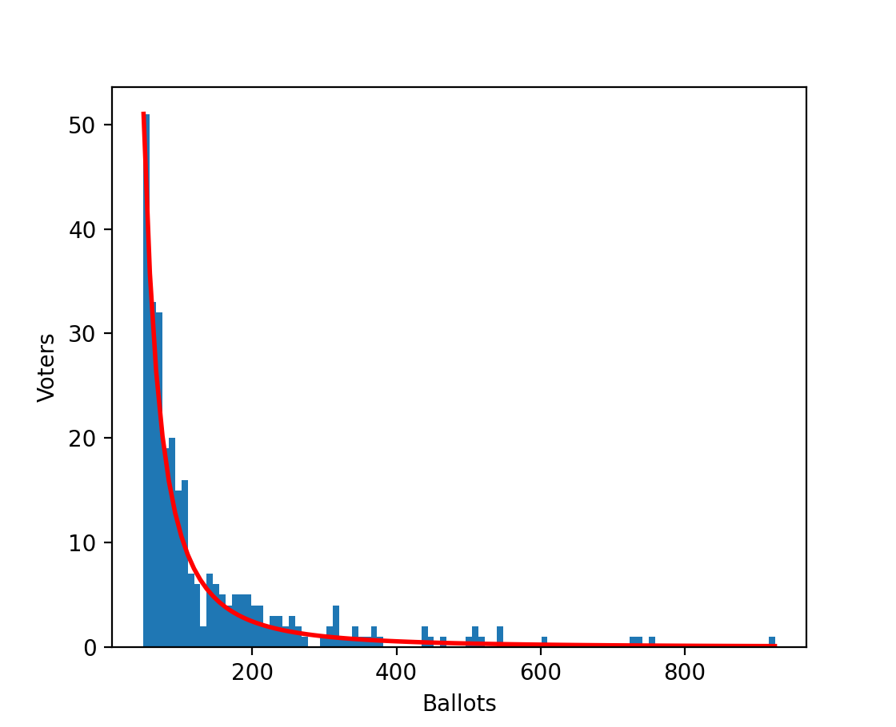

# PQV-simulator
Probabilistic Quadratic Voting Simulator.

# Visualization

### Pareto dist. of ballots

### Similarity among plain, QV and PQV (1)

exponent  : Graph : `[1.0, 1.5, 2.0, 2.5, 3.0]`

TODO

txWindow  : Graph : `range(10, 100 + 1, 10)` [%]

TODO

### Similarity among plain, QV and PQV (2)

Using the best hyperparameters from simulation 1 (Grid Search) .

* nPolicies : `range(2, 16 + 1, 2)`
* nAgents   : `range(30, 300 + 1, 30)`

<!--Heatmap-->
TODO
