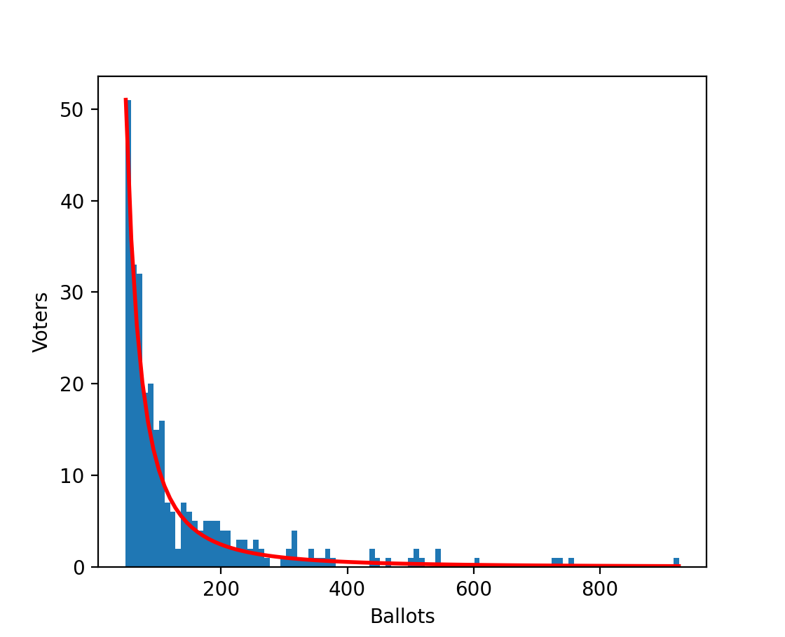
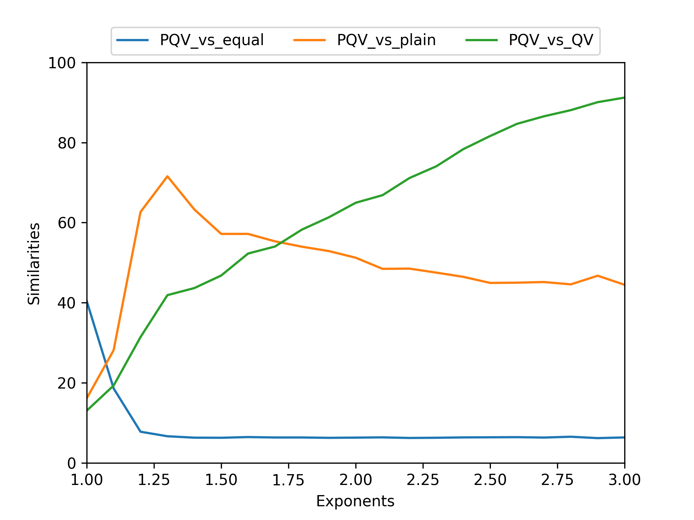
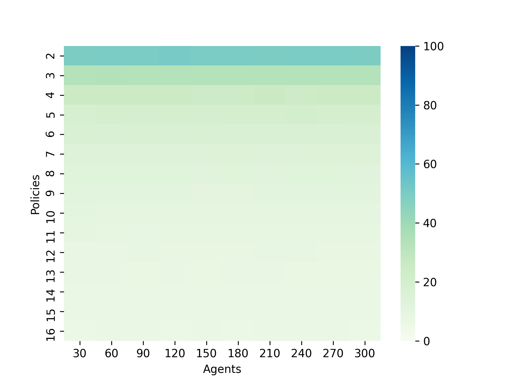
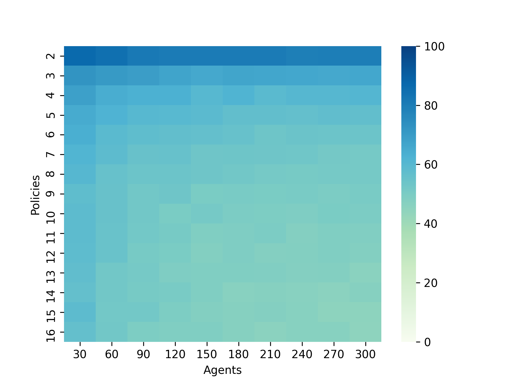
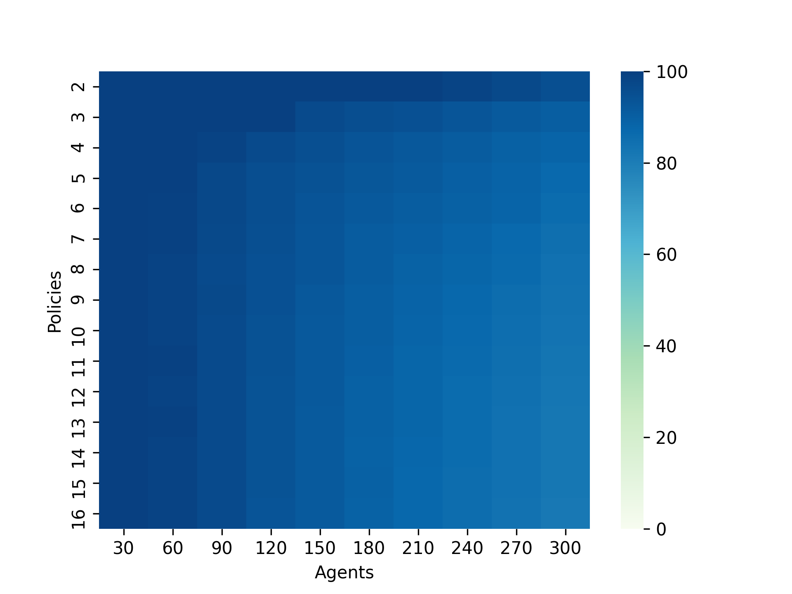

# PQV-simulator

Probabilistic Quadratic Voting Simulator

## `simulator_simularity`

* Calculate simularity among various voting methods.

## `simulator_heatmap`

* Calculate simularity and ready to visualize it in a heatmap.

## `simulator_ch`

* Simulator for [Chainlink Hackathon](https://chainlink-fall-hackathon-2021.devpost.com)
* PQV and QV similarity measurement for calculating the best hyperparameters such as *`e`* in PQV method.

# How-to-Run

Run script what you want to simulate. Python3 is required.

```
$ sh simul_simularity.sh [--option=value, ...]
$ sh simul_heatmap.sh [--option=value, ...]
$ sh simul_ch.sh [--option=value, ...]
```

# Visualize and Analysis
```
$ python getPlots.py
$ python getAverage.py
```

## Pareto dist. of ballots



## Similarity among equal, plain and QV versus PQV (1)

* exponent  : `seq 1.0 0.5 3.05`  # 3.0



<!--
txWindow    : Graph : `seq 10 10 100` [%]
-->

## Similarity among equal, plain and QV versus PQV (2)

Using the best hyperparameters from simulation 1 (Grid Search) .

* nPolicies : `seq 2 1 16`
* nAgents   : `seq 30 30 300`

### PQV vs. Equal



### PQV vs. Linear



### PQV vs. QV


